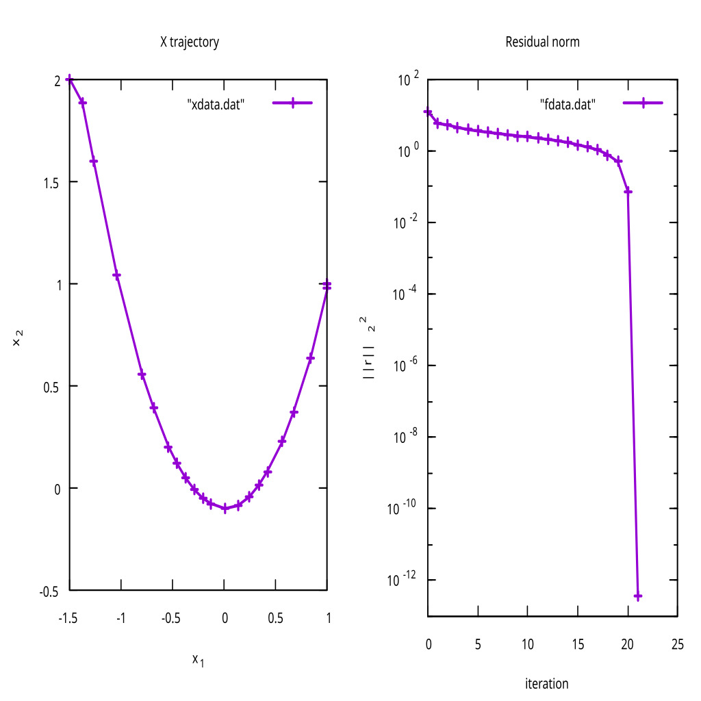
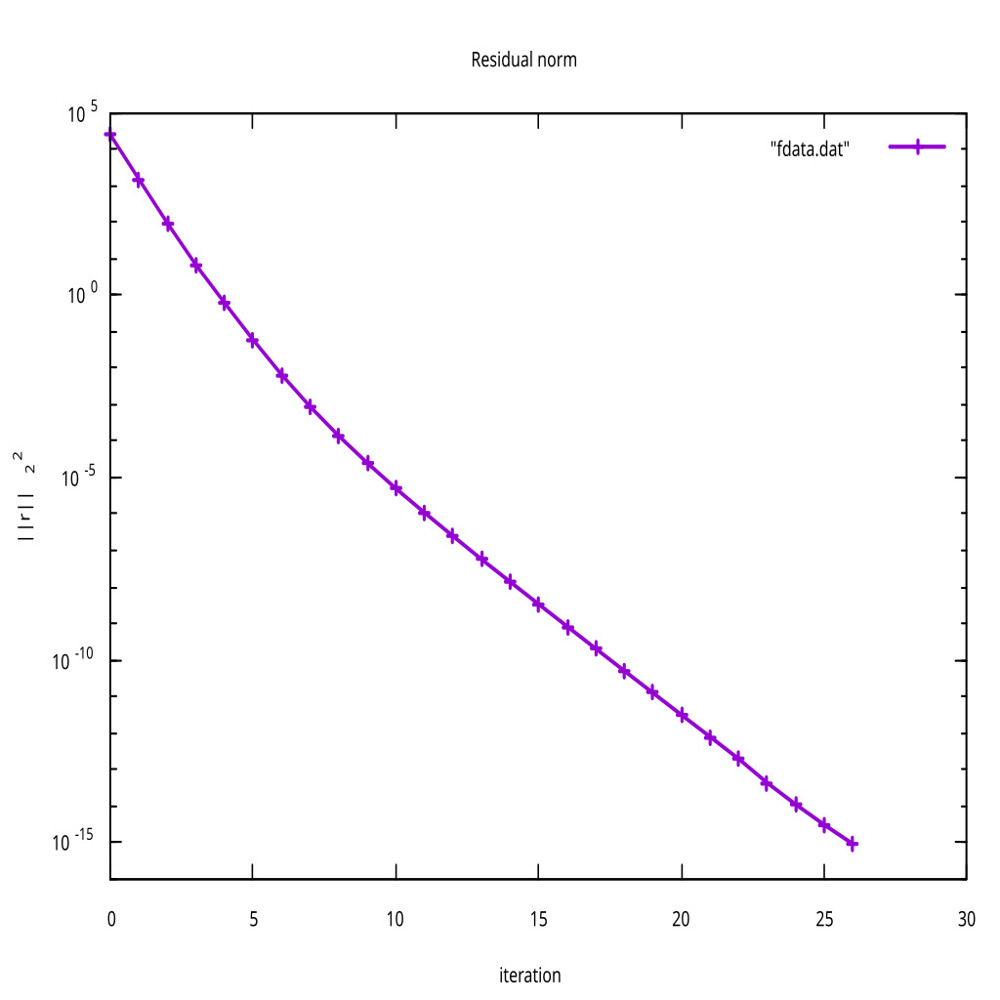

# Levenberg-Marquardt
This is my implementation of Levenberg-Marquardt algorithm using Armijo line search with dynamic dampening.


To install Eigen:
```bash
sudo apt update
sudo apt install libeigen3-dev
```

---

## Benchmark tests
Rosenbrock and Powell function where tested to verify the implementation.

### Rosenbrock's Function in 2D
The Rosenbrock function is

$r_0(x) = 10(x_1 - x_2^2)$

$r_1(x) = 1 - x_1$

Using start position $x^{0} = (-1.5, 2.0)^T$, we get

| Iter | $x_1$       | $x_2$       | Cost      |
|------|----------|----------|-----------|
| 1    | -1.376   |  1.883   | 5.653e+00 |
| ...  | ...      | ...      | ...       |
| 21   |  1.000   |  1.000   | 0.000e+00 |


### Powell's Function in 4D

The Powell function is

$r_0(x) = x_1 + 10x_2$

$r_1(x) = \sqrt{5} (x_3 - x_4)$

$r_2(x) = (x_2 - 2x_3)^2$

$r_3(x) = \sqrt{10} (x_1 - x_4)^2$

Using start position $x^{0} = (-2.5, 3.7, -4.1, 1.8)^T$, we get

|Iter| $x_1$      | $x_2$    | $x_3$      | $x_4$      | Cost     |
|----|---------|-------|---------|---------|----------|
|1   |-2.705   |0.454  |-2.746   |-0.554   |1.49e+03  |
|... |...      |...    |...      |...      |...       |
|26  |-0.000   |0.000  |-0.000   |-0.000   |9.03e-16  |
