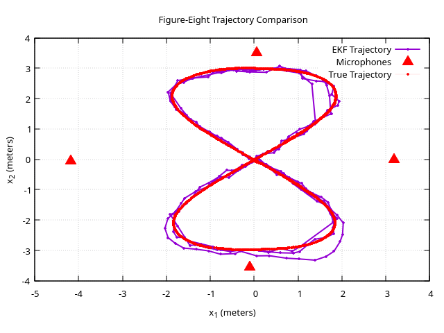
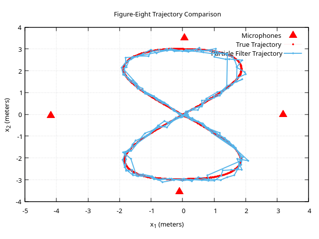

# Tracking

## Extended Kalman Filter
Basically the same as the oridnary Kalman filter but linearizes around the current state to estiamte the next.
I use finite difference to approximate the jacobians. This could be done analytically aswell but I was lazy. 
The central difference approach seems too work great though. 

The estimated positions of an RC-Car using EKF, together with the microphones and the true trajectory.

## Particle Filter
Populated the area with particles and resample based on the likelihood of the particle given the data. 
Doing this iteratively, only the most probable particles will stay. 

One candidate of the __best__ estimate is the linear combination of the particles using the weights.

The estimated positions of an RC-Car using PF, together with the microphones and the true trajectory.

## Data
Microphones where placed around in a room and a RC-Car beeped at around 2 Hz. The data was collected from the microphones to create delta times to estimate the position of the RC-Car.

